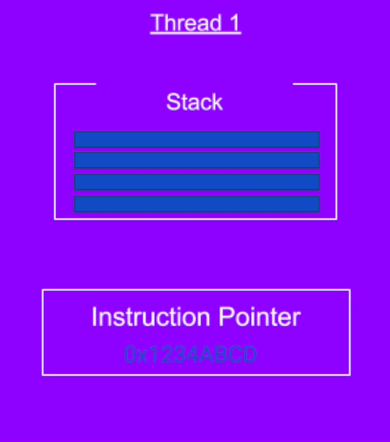

**1° Section: Motivation & Operating System Fundamentals**
-

**2 motivations for multithreading:**
- Responsiveness achieved by Concurrency. 
- Performance achieved by Parallelism;

**What the thread contains?**
- Stack - Region in memory, where local variable are stored, and passed into functions;
- Instruction Pointer, address of the next instruction to execute.
- 

**What threads share?**
- Files;
- Heap;
- Code.

**Context Switch**
- The act of stopping one thread, scheduling it out, scheduling in another thread and starting it 
is called context switch;
- Context switch is not cheap, and is the price of multitasking (concurrency);
- Same as we humans when we multitask - Takes time to focus.
- Each thread when running on a CPU occupies some resources like registers, cache in CPU and kernel resources
in the memory;
- When we switch to a different thread, we need to store all this data and restore the resources
of another thread back to the CPU and memory;

**Context Switch - Key Takeaways**
- Too many threads: Thrashing, spending more time in management than real productive work;
- Threads consume less resources than processes;
- Context switching between threads from the same process is cheaper than context switch between different processes

**2° Section: Threading fundamentals**
- Thread.class: Encapsulates all thread related functionality;
- Have two ways to run code on a new thread:
  - Implement Runnable interface, and pass to a new Thread object (See first here: [FirstWayCreateThread.java](src%2Fmain%2Fjava%2Forg%2Fmultithread%2Fcreation%2FFirstWayCreateThread.java));
  - Extend Thread class and create an object that class (See second here: [SecondWayCreateThread.java](src%2Fmain%2Fjava%2Forg%2Fmultithread%2Fcreation%2FSecondWayCreateThread.java)).
- Both ways are equally correct to run a new thread.